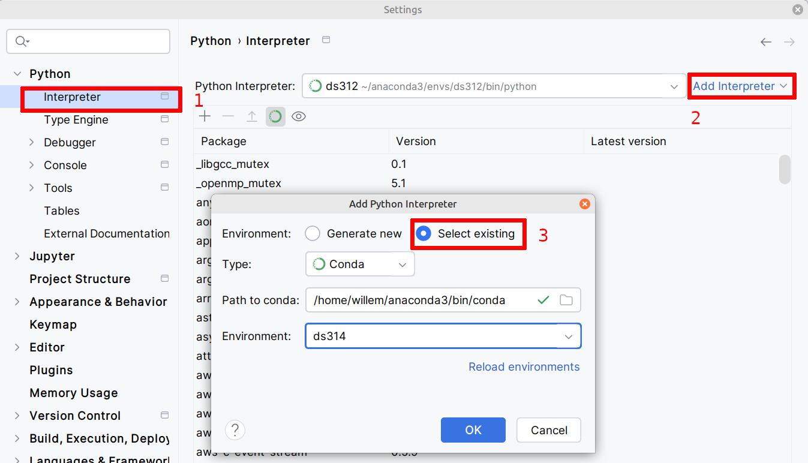

<style>
body {
  font-family: "Spectral", "Gentium Basic", Cardo , "Linux Libertine o", "Palatino Linotype", Cambria, serif;
  font-size: 100% !important;
  padding-right: 12%;
}
code {
  padding: 0.25em;
	
  white-space: pre;
  font-family: "Tlwg mono", Consolas, "Liberation Mono", Menlo, Courier, monospace;
	
  background-color: #ECFFFA;
  //border: 1px solid #ccc;
  //border-radius: 3px;
}

kbd {
  display: inline-block;
  padding: 3px 5px;
  font-family: "Tlwg mono", Consolas, "Liberation Mono", Menlo, Courier, monospace;
  line-height: 10px;
  color: #555;
  vertical-align: middle;
  background-color: #ECFFFA;
  border: solid 1px #ccc;
  border-bottom-color: #bbb;
  border-radius: 3px;
  box-shadow: inset 0 -1px 0 #bbb;
}

h1,h2,h3,h4,h5 {
  color: #269B7D; 
  font-family: "fira sans", "Latin Modern Sans", Calibri, "Trebuchet MS", sans-serif;
}

</style>

# Creating a new conda environment `ds314` on `@mint-22`

## Context
- We need a new conda data science oriented environment on `@mint-22` based on `ds312`. 
- As it will be based on Python 3.14, we will name it `ds314`

## Workflow
1. We already installed Anaconda as described at [../Anaconda_installation@mint-22.md](../Anaconda_installation@mint-22.md)
2. We recently updated the `base` environment with the latest version of anaconda, see
   [../Anaconda_maintenance_strategy.md](../Anaconda_maintenance_strategy.md)
3. We now will create a conda environment named `ds314` based on `ds312`, but with Python 3.14 as basis
   1. We use [ds312-conda-env-creation@mint-22.md#conda-installation-steps](ds312-conda-env-creation@mint-22.md#conda-installation-steps) 
      as reference

## Main packages that need to be installed
- many packages are transitive dependencies and will be automatically installed with the main ones
- For some other projects than this one additional packages will be installed, we list them per project

### Packages needed for _DataAnalysisWithPythonAndPySpark_ repo
- PySpark, will include many transitive dependencies including
  - pandas
  - numpy
- (Jupyter) Notebook
- matplotlib
- wget (for obtaining data in chapter 7)
- python-dotenv used by the `project_utils.config_info` module

### Packages needed for _practical-statistics-for-data-scientists_ repo
- yfinance

### Packages needed for _e-math-4-ds_
- sympy
- scipy (including scipy-stubs)
- seaborn, a simpler graph construction interface on top of matplotlib

## Steps
- `conda create -n ds314`
  - `conda activate ds314`
- `conda install -n ds314 python=3.14`
  - `conda activate ds314` - activate the environment after each installation or update to make changes visible
  - `python --version` - check the version
  - `which python` -check the location
- `conda install -n ds314 pyspark`
  - `conda activate ds314`
- `conda install -n ds314 notebook`
  - `conda activate ds314`
- `conda install -n ds314 matplotlib`
  - `conda activate ds314`
- `conda install -n ds314 wget`
  - `conda activate ds314`
- `conda install -n ds314 python-dotenv` used by our `project_utils.config_info` module of
  _DataAnalysisWithPythonAndPySpark_
  - `conda activate ds314`
- `conda install -n ds314 -c conda-forge yfinance`
  - we needed to specify the channel `conda-forge` to be able to find the package
  - `conda activate ds314`
- `conda install -n ds314 sympy`
  - `conda activate ds314`
- `conda install -n ds314 conda-forge::scipy-typed`
  - This is a combined installation of scipy and scipy-stubs (for reliable type annotations for scipy), see
    [https://github.com/scipy/scipy-stubs](https://github.com/scipy/scipy-stubs).
  - alternatively, two separate commands could be used
    - `conda install -n ds314 scipy` and
    - `conda install -n ds314 conda-forge::scipy-stubs`
  - `conda activate ds314`
- `conda install -n ds314 seaborn`
  - `conda activate ds314`
- `conda update -n ds314 --all --no-pin` to see if packages can be updated or harmonized
  - `conda activate ds314`
- `conda env export --no-builds > ds314_env_--no-builds_20260510.yml` to export the entire configuration of
  `ds314` on 10-05-2026

## Testing _ds314_

### Within PyCharm

#### Configure the _ds314_ conda environment
- First set the new _ds314_ conda environment as python interpreter
  - File > Settings > Python > interpreter click on _Add interpreter_
  - From the popup window select
    - Select existing
    - Type: _Conda_
    - Environment: _ds314_
      
    - OK
  - OK
- Now the PyCharm project will need some time to index the new set of packages

#### Run some python scrips within PyCharm
- e.g.
  - [../../../src/Ch07/more_periodic_table.py](../../../src/Ch07/more_periodic_table.py)
  - [../../../src/bankstatements/df_prep.py](../../../src/bankstatements/df_prep.py)
- Both work well

#### Problem Running some scripts from CLI
`(ds314) willem@mint-22:~/git/DataAnalysisWithPythonAndPySpark/src/bankstatements$ PYTHONPATH=../ python ./df_prep.py 2019`
yield
----
```bash
File "/home/willem/anaconda3/envs/ds314/lib/python3.14/site-packages/pyspark/sql/session.py", line 636, in __init__
    jSparkSessionClass.getDefaultSession().isDefined()
    ~~~~~~~~~~~~~~~~~~~~~~~~~~~~~~~~~~~~^^
TypeError: 'JavaPackage' object is not callable
```
----
with
- `JAVA_HOME=/home/willem/.sdkman/candidates/java/current` which points to `java 21.0.11-tem`,
- `SPARK_HOME=/home/willem/.sdkman/candidates/spark/current` which points to the default `3.5.3`
- Trying the old `ds312` works fine
  ```bash
  (ds314) willem@mint-22:~/git/DataAnalysisWithPythonAndPySpark/src/bankstatements$ conda activate ds312
  (ds312) willem@mint-22:~/git/DataAnalysisWithPythonAndPySpark/src/bankstatements$ PYTHONPATH=../ python ./df_prep.py
  ```
  works fine.
- changing `SPARK_HOME` to latest `4.0.0-preview-2`
  ```bash
  (ds314) willem@mint-22:~/git/DataAnalysisWithPythonAndPySpark/src/bankstatements$ sdk current spark

  Using spark version 3.5.3
  (ds314) willem@mint-22:~/git/DataAnalysisWithPythonAndPySpark/src/bankstatements$ sdk use spark 4.0.0-preview2 
  
  Using spark version 4.0.0-preview2 in this shell.
  (ds314) willem@mint-22:~/git/DataAnalysisWithPythonAndPySpark/src/bankstatements$ sdk current spark
  
  Using spark version 4.0.0-preview2
  ```
- `(ds314) willem@mint-22:~/git/DataAnalysisWithPythonAndPySpark/src/bankstatements$ PYTHONPATH=../ python ./df_prep.py`
  Now shows `SPARK_HOME=/home/willem/.sdkman/candidates/spark/4.0.0-preview2` 
  (also reflected in `PATH`, which also shows `:/home/willem/anaconda3/envs/ds314/bin:`)
- Problem remains
- `(ds312) willem@mint-22:~/git/DataAnalysisWithPythonAndPySpark/src/bankstatements$ PYTHONPATH=../ python ./df_prep.py`
  - still with `SPARK_HOME=/home/willem/.sdkman/candidates/spark/4.0.0-preview2`
  - works, so SPARK_HOME doesn't seem to effect things

##### Fix by unsetting `SPARK_HOME`
This works
```bash
(ds312) willem@mint-22:~/git/DataAnalysisWithPythonAndPySpark/src/bankstatements$ conda activate ds314
(ds314) willem@mint-22:~/git/DataAnalysisWithPythonAndPySpark/src/bankstatements$ unset SPARK_HOME
(ds314) willem@mint-22:~/git/DataAnalysisWithPythonAndPySpark/src/bankstatements$ unset PYSPARK_SUBMIT_ARGS
(ds314) willem@mint-22:~/git/DataAnalysisWithPythonAndPySpark/src/bankstatements$ printenv SPARK_HOME
(ds314) willem@mint-22:~/git/DataAnalysisWithPythonAndPySpark/src/bankstatements$ printenv PYSPARK_SUBMIT_ARGS
(ds314) willem@mint-22:~/git/DataAnalysisWithPythonAndPySpark/src/bankstatements$ PYTHONPATH=../ python ./df_prep.py 2019
```
- [https://www.perplexity.ai/search/i-want-to-update-my-conda-envi-w5ntvRByRRa31PO9eimjCA?sm=d](https://www.perplexity.ai/search/i-want-to-update-my-conda-envi-w5ntvRByRRa31PO9eimjCA?sm=d)
- Do the same `unset SPARK_HOME PYSPARK_SUBMIT_ARGS` before running `jupyter notebook` in a terminal on 
  a directory that contains some `*.ipynb` files.
- Looking for a more permanent solution
  - uninstall spark from sdkman can be done as it is not needed when running Java applications locally as well, like in
    - [https://github.com/wjc-van-es/spark-labs](https://github.com/wjc-van-es/spark-labs)
  - SDKMan! will not release spark 4.1.1 in the near future:
  - [https://spark.apache.org/downloads.html](https://spark.apache.org/downloads.html)
  - [https://github.com/sdkman/sdkman-candidates/issues/75](https://github.com/sdkman/sdkman-candidates/issues/75)
