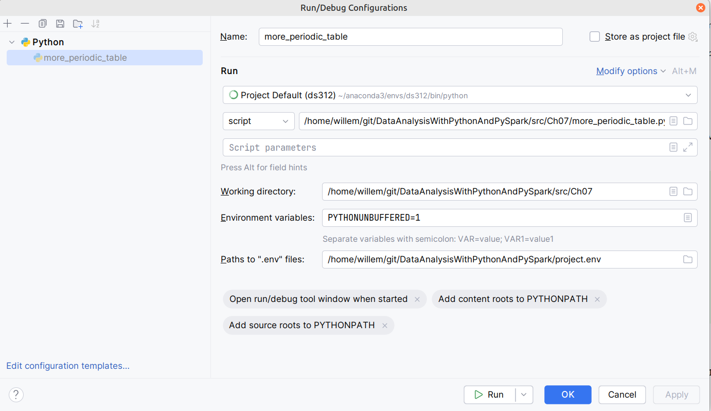

<style>
body {
  font-family: "Gentium Basic", Cardo , "Linux Libertine o", "Palatino Linotype", Cambria, serif;
  font-size: 100% !important;
  padding-right: 12%;
}
code {
  padding: 0.25em;
	
  white-space: pre;
  font-family: "Tlwg mono", Consolas, "Liberation Mono", Menlo, Courier, monospace;
	
  background-color: #ECFFFA;
  //border: 1px solid #ccc;
  //border-radius: 3px;
}

kbd {
  display: inline-block;
  padding: 3px 5px;
  font-family: "Tlwg mono", Consolas, "Liberation Mono", Menlo, Courier, monospace;
  line-height: 10px;
  color: #555;
  vertical-align: middle;
  background-color: #ECFFFA;
  border: solid 1px #ccc;
  border-bottom-color: #bbb;
  border-radius: 3px;
  box-shadow: inset 0 -1px 0 #bbb;
}

h1,h2,h3,h4,h5 {
  color: #269B7D; 
  font-family: "fira sans", "Latin Modern Sans", Calibri, "Trebuchet MS", sans-serif;
}

</style>

# Creating a new conda environment `ds312` on `@mint-22`

## Context
- We need a new conda data science oriented environment on `@mint-22` based on `ds311`. 
- As it will be based on Python 3.12, we will name it `ds312`

## Workflow
1. We installed Anaconda as described at [Anaconda_installation@mint-22.md](Anaconda_installation@mint-22.md)
2. We now will create a conda environment named `ds312` based on `ds311`, but with Python 3.12 as basis
   1. We use [ds311-env-creation@linux-laptop.md#steps](ds311-env-creation@linux-laptop.md#steps) as reference

## Conda Installation Steps
1. Create the new `ds312` conda environment
   1. `(base) ~/git/DataAnalysisWithPythonAndPySpark$ conda deactivate`
   2. `~/git/DataAnalysisWithPythonAndPySpark$ conda create -n ds312`
   3. ```bash
      willem@mint-22:~/git/DataAnalysisWithPythonAndPySpark$ conda activate ds312
      (ds312) willem@mint-22:~/git/DataAnalysisWithPythonAndPySpark$ python --version
      Command 'python' not found, did you mean:
      command 'python3' from deb python3
      command 'python' from deb python-is-python3
      ```
2. Install Python 3.12 on the `ds312` environment
   1. `(ds312) willem@mint-22:~/git/DataAnalysisWithPythonAndPySpark$ conda install -n ds312 python=3.12`
   2. Testing
      1. ```bash
         (ds312) willem@mint-22:~/git/DataAnalysisWithPythonAndPySpark$ which python
         /home/willem/anaconda3/envs/ds312/bin/python
         (ds312) willem@mint-22:~/git/DataAnalysisWithPythonAndPySpark$ python --version
         Python 3.12.8
         ```
3. Installing PySpark on the `ds312` environment
   1. `(ds312) willem@mint-22:~/git/DataAnalysisWithPythonAndPySpark$ conda install -n ds312 pyspark`
   2. `(ds312) willem@mint-22:~/git/DataAnalysisWithPythonAndPySpark$ conda activate ds312`
4. Install (jupyter) notebook
   1. `(ds312) willem@mint-22:~/git/DataAnalysisWithPythonAndPySpark$ conda install -n ds312 notebook`
   2. `(ds312) willem@mint-22:~/git/DataAnalysisWithPythonAndPySpark$ conda activate ds312`
   3. For the time being we skipped `conda install -n ds312 -c conda-forge nb_conda_kernels`
      Let's see whether this really necessary
5. Installing matplotlib on the `ds312` environment
   1. `(ds312) willem@mint-22:~/git/DataAnalysisWithPythonAndPySpark$ conda install -n ds312 matplotlib`
   2. `(ds312) willem@mint-22:~/git/DataAnalysisWithPythonAndPySpark$ conda activate ds312`
6. See if any updates are possible
   1. `conda update -n ds312 --all --no-pin` yielded no newer package versions

## Testing
We need to test if this is enough for the `man-py-htm` and `DataAnalysisWithPythonAndPySpark` projects

### `man-py-htm` to test _jupyter notebook_ capability
- activate jupyter notebooks
  ```bash
  (base) willem@mint-22:~/git/man-py-htm$ conda activate ds312
  (ds312) willem@mint-22:~/git/man-py-htm$ jupyter notebook
  ```
  - This opens the browser and any notebook can be opened and rerun.

### `DataAnalysisWithPythonAndPySpark` try out _PySpark_ and _matplotlib_
- We think that a Java and a Spark installation from SDKMan! are necessary as well for successfully using PySpark,
  but we start out trying without.
- First we need to make the PyCharm project using the conda ds312 environment with
  File > Settings... > Project:DataAnalysisWith... > Python Interpreter > Add Interpreter
  - Select existing conda environment and _ds312_ should be selectable:
    
- Now we can test [`../src/Ch07/more_periodic_table.py`](../src/Ch07/more_periodic_table.py)
  - With the import statements we can see that the PySpark package modules are importable, but our local 
    [`../src/project_utils`](../src/project_utils) module is _not_.
  - We need to assign [`../src`](../src) as sources root within the PyCharm project by using the _Mark Directory as_
    from the _Right Mouse Context Menu_ and choose _Sources Root_
  - See also [creating_&_using_modules.md#configuration](creating_&_using_modules.md#configuration)
  - We see the error log: `JAVA_HOME is not set`

#### Java & Spark installation and configuration
- We probably need the most recent version of Spark available and then a compatible version Java version
- Currently, we have Java 17 & 21 installed:
  ```bash
  (ds312) willem@mint-22:~/git/DataAnalysisWithPythonAndPySpark$ sdk list java | grep 'tem'
  Temurin       |     | 23.0.2       | tem     |            | 23.0.2-tem          
                |     | 23.0.1       | tem     |            | 23.0.1-tem          
                |     | 21.0.6       | tem     |            | 21.0.6-tem          
                |     | 21.0.5       | tem     | installed  | 21.0.5-tem          
                | >>> | 17.0.13      | tem     | installed  | 17.0.13-tem         
                |     | 11.0.25      | tem     |            | 11.0.25-tem         
                |     | 8.0.442      | tem     |            | 8.0.442-tem         
                |     | 8.0.432      | tem     |            | 8.0.432-tem         
  Omit Identifier to install default version 21.0.6-tem:
        $ sdk install java 21.0.6-tem
  (ds312) willem@mint-22:~/git/DataAnalysisWithPythonAndPySpark$
  ```
- `sdk list spark` reveals _3.5.3_ the most recent stable version of Spark
- [https://spark.apache.org/docs/3.5.3/](https://spark.apache.org/docs/3.5.3/) reveals that Java 17 may be used.
  - Java 17.0.13-tem is currently also the default installation

##### Adding environment variables
- adding `JAVA_HOME` to [`../project.env`](../project.env) file
- adding [`../project.env`](../project.env) to a _run / debug config_ of 
  [`../src/Ch07/more_periodic_table.py`](../src/Ch07/more_periodic_table.py)
  
- an SDKMan! Spark installation isn't necessary for this script to run
- You have to add this config to each _run / debug config_ of each script run from PyCharm
- alternatively, we could use the python-dotenv package
  - `(ds312) $ conda install -n ds312 python-dotenv`
  - `(ds312) $ conda activate ds312`
  - Modifying [../src/Ch06/listing_6.14_6.15_create_tabular_episodes.py](../src/Ch06/listing_6.14_6.15_create_tabular_episodes.py)
    to try out loading [`../project.env`](../project.env) within the script code
  - This works as well
  - basically use
    ```python
    import os
    from dotenv import load_dotenv
    
    print(os.path.abspath('.'))
    load_dotenv('../../project.env')
    print(f"JAVA_HOME={os.getenv('JAVA_HOME')}")
    ```
    
### ToDo
- test matplotlib (from jupyter notebooks)
- test the bank statements analysis
- 